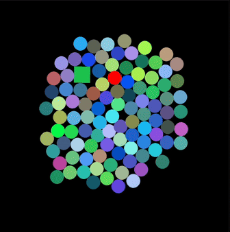

# Hierarchical-Deep-Reinforcement-Learning-for-Multi-Agent-Swarm-Robotics
Hierarchical Deep Reinforcement Learning for Multi-Agent Swarm Robotics with ArUco-Based Visual Tracking

# 2D physics engine
- Supports squares and circles and the collision between them and the rectangular outer bounds.
- Supports elastic collisions

